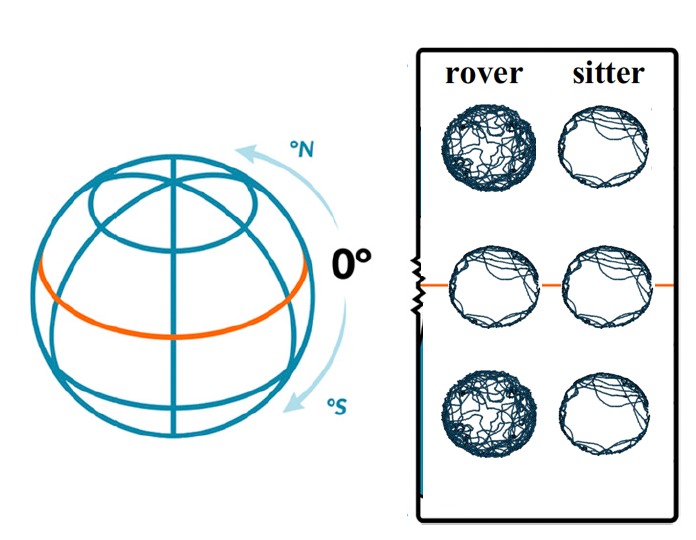

```{r setup, include = FALSE}

library(rmarkdown)
library(xaringan)
library(xaringanExtra)
library(knitr)
library(icons)
library(emo)
library(lattice)
require(phylopath)
require(ggplot2)
require(gridExtra)
require(grid)
require(ggraph)
require(phylolm)

## preset code chunk options

knitr::opts_chunk$set(dpi = 300,            # ensures high resolution images
                      echo = FALSE,         # FALSE: code chunks don't show
                      warning = FALSE,      # FALSE: suppresses warning messages
                      error = FALSE,       # FALSE: Suppresses error messages
                      fig.align = "center")

```


***

## Acknowledgement

\begincols
  \begincol{.48\textwidth}


\centering

{#id .class height=30%}

  \endcol
\begincol{.48\textwidth}

\centering

 \linebreak Joaquin Nunez

  \endcol
\endcols


# Introduction:

***

## The foraging-mode paradigm \linebreak

\centering


***

## \textit{Drosophila melanogaster} foraging behavior

\centering


{#id .class height=30% width=50%} {#id .class height=50% width=70%}


***

## The Drosophila \textit{foraging} gene provides an opportunity to understand the mechanisms underlying evolutionary responses to environmental variation

\begincols
  \begincol{.48\textwidth}


\justifying

1. Given its allelic variants, one should expect geographic variation of the \textit{for} gene among populations

  \endcol
\begincol{.48\textwidth}

\justifying



  \endcol
\endcols


***

## The Drosophila \textit{foraging} gene provides an opportunity to understand the mechanisms underlying evolutionary responses to environmental variation

\begincols
  \begincol{.48\textwidth}


\justifying

2. The DEST dataset enables one to study genetic variation accross populations spanning America and Europe

  \endcol
\begincol{.48\textwidth}

\justifying


  \endcol
\endcols


# Materials and Methods:

***

## Analyses


- Genetic differentiation among populations according to Weir and Cockerham (1984)

- Population structure based on admixture proportions

- Genotype–environment association analysis based on LFMMs with a ridge penalty (Jumentier et al., 2022)

- Isolation by environment and isolation by distance \linebreak \linebreak

\begincols
  \begincol{.48\textwidth}

\centering

```{r fig.align="center"}

icon_style(fontawesome("r-project", style = "brands"), scale = 4)

```

  \endcol
\begincol{.48\textwidth}

\centering


  \endcol
\endcols


# Results and Discussion:


***

## A genetic differentiation test, and an analysis of population structure revealed an east-west gradient in allele frequency \linebreak

\begincols
  \begincol{.48\textwidth}


\justifying


  \endcol
\begincol{.48\textwidth}

\justifying

{#id .class heigth=90% width=90%}

  \endcol
\endcols


***

## Stronger structure in populations collected in America than those collected in Europe, although the structure of pools from Ukraine, Turkey, and Russia stands out


\begincols
  \begincol{.48\textwidth}


\justifying


  \endcol
\begincol{.48\textwidth}

\justifying


  \endcol
\endcols


***

## Spatially varying selection driven by the seasonality of precipitation

\centering

{#id .class heigth=50% width=50%}

***

## Models of isolation by environment and isolation by distance are likely driving genetic differentiation among populations \linebreak

\begincols
  \begincol{.48\textwidth}


\justifying

{#id .class heigth=90% width=90%}

  \endcol
\begincol{.48\textwidth}

\justifying

{#id .class heigth=90% width=90%}

  \endcol
\endcols

***

## Concluding remarks

- East–west gradient in allele frequency across populations

- Dmel populations are genetically differentiated resulting from spatially varying selection driven by the seasonality of precipitation \linebreak

\centering

Scan the qr-code below for access to the paper:

{#id .class heigth=20% width=20%}

